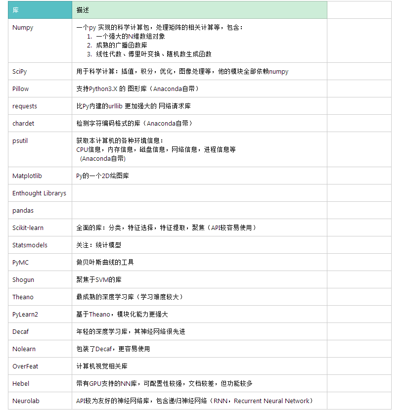

# 从 Py民 到 Py神
----
* base: Python 基础语法
* oo: Python 面向对象编程
* libs: Python 常用内建库 和 第三方库
### 历史

	* 诞生：1989
	* 创始人： Guido van Rossum 吉多 ，为了打发时间，开发的一种新的脚本解释程序
	* Python3.0 2008年开始存在
	* 2014 年：Python2.0 停止支持 和 版本更新
	* 1.0版本已经有了对lambda,map,filter, reduce等的支持
	* 2.0 在2000年诞生，加入了内存回收机制
	* 最流行WEB框架：Django 在 Py2.4 （2004年） 诞生

### 特点
* 优点
  * 简洁（融合各大语言的特点）
  * 第三方库多
  * 可移植性强（Python虚拟机，类Java）
* 缺点
  * 源码不可加密（类JS）
  * 运行速度慢

### 环境
* python3.6

  
* PyCharm 2017
* Anaconda

> 安装包这里拿：\\WUJA13-W7\Python_ML

### Python 基础
  > 参考链接：
     [Python3 官方文档](https://docs.python.org/3/reference/index.html#reference-index)
		 [廖雪峰的官方网站](https://www.liaoxuefeng.com/wiki/0014316089557264a6b348958f449949df42a6d3a2e542c000)
	   [W3CSchool Py3教程](https://www.w3cschool.cn/python3/)
	   [一文掌握Python](http://mp.weixin.qq.com/s?__biz=MjM5NzM0MjcyMQ==&mid=2650076095&idx=2&sn=90a3ab6e2b5f881151b17a7edec58175&chksm=bedb28d189aca1c7186824772706a420fb2b0a1744e4ce1e4330cae14dad505000d165d0cfb4&scene=0#rd)

[Pypy 和 CPython 区别](http://pypy.readthedocs.io/en/latest/cpython_differences.html)

> 注意：在bytes中，无法显示为ASCII字符的字节，用\x##显示s

内置基本类型（对比java 和 c）
Python 的语法  和 Javascript 、Kolin 相似。
> 注意： Python存在 一个缓存池：小整数对象池：[-5, 257)

注意点：
  * 函数式编程的一个特点：允许参数是一个函数， 允许返回值是一个函数。虽然 Python 并不是一个纯函数式编程语言，但是 函数当参数等类JS的操作还是完全OK的。
  * Python匿名函数有个限制： 只能有一个表达式 ，如 lambda 关键字： lambda x: x*x

### Python 标准库

[Python3 标准库官方文档](https://docs.python.org/3/library/index.html)

[Python3 内建函数库](https://docs.python.org/3/library/functions.html)

### Python 第三方库（ML）

依赖的工具： pip 【python 包管理器】
（一般安装python都会顺带安装这个包管理器）

安装某个库：
1. 命令行执行：
  `pip install Pillow`
2. 直接用 Anaconda，很多库都帮你安装好了的。

以下是机器学习相关的常用经典库：

知识扩展：
* [什么是支持向量机（SVM）](https://www.zhihu.com/question/21094489)

写一下公式，看看能不能识别：
$\sqrt[x]{y^4+3y-1}$

